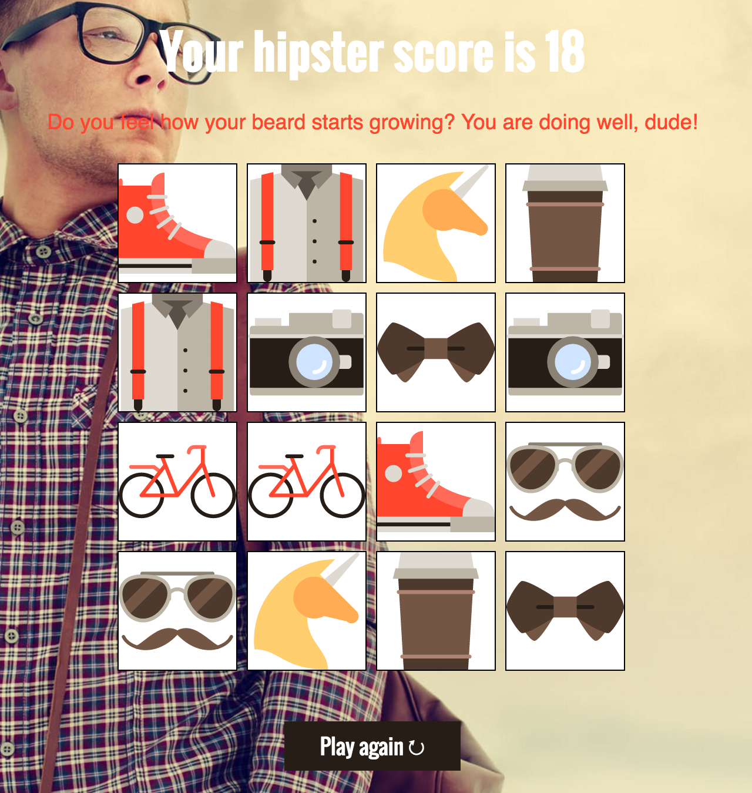

#What is a hipster, man?#

My project's main purpose was to create a simple memory game in pure HTML, CSS, JS.

##1. Example##

This screenshot show the basic flow of the game

*Beginning of the game*

*End of the game*

The game is repeated after the user presses the **"Play again↻"** button.

##2. Installation##

No installation is required since the project is a simple web application with a JS script inside.

To run the project, simply run the [index.html](index.html).

The project was tested in major modern browsers (Safari, Chrome, Firefox, etc.) and behaves correctly.

The code was checked by the [W3C Markup Validation Service](W3C Markup Validation Service) and [W3C CSS Validation Service](https://jigsaw.w3.org/css-validator/).

All the selectors were checked whether they require any web browser prefix.

##3. Program flow##

The website is organized in a sequential way. Firstly, the users get to know about a hipster stereotypes.

Secondly, the users look at the "study" material so that to enhance their knowledge in the topic.

Last but not the least the play a simple memory game to match pairs of features that only true hipsters have!

The game result is stored so that to be shown along with a message with further steps to dive into the topic if necessary. The message is shown only if all the pairs are solved.

The rating system is chosen on the basis of game experience and estimated to such levels based on the amount of clicks done by the user:

scores amount | type of level
-------|----------------------------------------
8-16 | The super hipster level
16-24 | The middle hipster level
24 and higher | Not the hipster level
